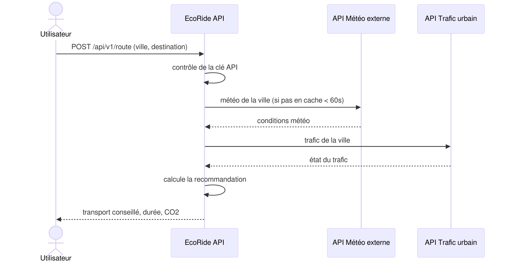

# Diagramme de séquence - EcoRide API

Flux d'une requête `POST /api/v1/route`.

Lecture :

1. L'API vérifie la clé API (401 si invalide)
2. La météo est lue depuis le cache si elle a moins de 60 secondes,
   sinon l'API météo externe est appelée (503 si elle ne répond pas)
3. Le trafic est toujours demandé en direct, il change trop vite pour
   être mis en cache
4. `calculate_best_route` croise météo et trafic, la réponse est
   renvoyée au client

Premier appel pour une ville : ~800 ms. Appels suivants dans la minute :
~300 ms (météo en cache).
